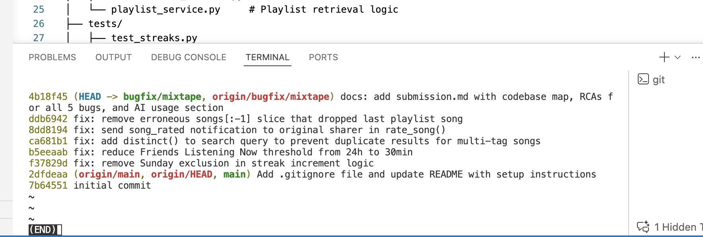

# Project 5: Mixtape Bug Hunt - Submission

## AI Usage

I used GitHub Copilot as an AI assistant during this project, mainly for codebase orientation and understanding unfamiliar code.

**How I used it:**

1. **Reading the codebase:** I pasted the service files into the chat and asked it to summarize what each module does and what the main functions are responsible for. It helped me get a quick mental model without having to read every line from scratch. I still went back and read the actual code to verify what it told me.

2. **Understanding a specific bug:** For Issue #1, once I found the suspicious condition in `update_listening_streak()`, I asked the AI to confirm what `datetime.weekday()` returns for each day (Monday=0, Sunday=6). That confirmed my hypothesis. For Issue #3, I asked it to explain what happens to query results when you do an outer join on a one-to-many table without deduplication. That helped me understand why songs with multiple tags were showing up more than once.

**Where I disagreed with the AI:**

For Issue #2, the AI first suggested the problem might be a timezone mismatch between aware and naive datetimes. I checked the code and the filter was working fine. The actual problem was just that `timedelta(hours=24)` is too wide a window for something called "Listening Now." I went with the simpler fix instead of the AI's suggestion.

For all bugs, I read the code myself first and only used the AI to help confirm or explain things I had already found.

---

## Codebase Map

*Written before any bug work.*

### Main Files and Their Roles

| File | Responsibility |
|------|---------------|
| `app.py` | Flask app factory. Sets up the app, registers blueprints, and initializes the SQLAlchemy DB. |
| `models.py` | All SQLAlchemy models: `User`, `Song`, `Tag`, `ListeningEvent`, `Rating`, `Playlist`, `Notification`. Also has three association tables: `friendships`, `song_tags`, and `playlist_entries` (which includes a `position` column for ordering). |
| `routes/songs.py` | Endpoints for sharing, searching, and rating songs. |
| `routes/playlists.py` | Endpoints for creating playlists and adding songs to them. |
| `routes/users.py` | Endpoints for user profiles, streaks, and notifications. |
| `routes/feed.py` | Endpoints for "Friends Listening Now" and the activity feed. |
| `services/streak_service.py` | Handles streak logic. Records a `ListeningEvent` and updates `user.listening_streak` based on consecutive calendar days. |
| `services/feed_service.py` | Returns friends who listened recently (`get_friends_listening_now`) and a general activity feed (`get_activity_feed`). |
| `services/search_service.py` | Searches songs by title or artist using a case-insensitive match, with a join on `song_tags`. |
| `services/notification_service.py` | Creates notifications when someone interacts with a shared song. Also handles saving ratings. |
| `services/playlist_service.py` | Creates playlists and fetches their songs in order by `position`. |

### Data Flow: User Rates a Song

1. Client sends `POST /songs/<song_id>/rate` with `user_id` and `score`.
2. `routes/songs.py` reads the request body and calls `notification_service.rate_song(user_id, song_id, score)`.
3. `rate_song()` checks the score is between 1 and 5, looks up the song and user, upserts a `Rating` record, commits to the DB, then calls `create_notification()` to notify the original sharer.
4. `create_notification()` inserts a `Notification` row with type `"song_rated"`.
5. The route returns the rating as JSON.

### Pattern I Noticed

Every route hands off to a service function right away. The route only handles reading the request and formatting the response. All the real logic is in `services/`. Once I understood that, tracing any bug was straightforward: find the route, find the service call, read the service function.

---

## Bug Fixes

---

### Issue #1 - My listening streak keeps resetting

**How I reproduced it:**

Opened `streak_service.py` and read through `update_listening_streak()`. The function has three branches: no change if the user already listened today, increment if it's been exactly 1 day, reset otherwise. I noticed the increment branch had an extra condition: `today.weekday() != 6`. That means on Sundays, the increment never runs. The streak resets instead.

**How I found the root cause:**

Read `services/streak_service.py` top to bottom. The condition `elif days_since_last == 1 and today.weekday() != 6` was the only part that looked out of place. There's no reason Sunday should be treated differently from any other day for streak tracking.

**The root cause:**

`datetime.weekday()` returns `6` for Sunday. The condition `today.weekday() != 6` evaluates to `False` on Sundays, which means a user who listened on Saturday and again on Sunday would skip the increment branch entirely and land in the `else` (reset to 1). The streak would drop back to 1 every Sunday regardless of the user's listening history.

**Fix and side-effect check:**

Removed `and today.weekday() != 6` from the condition, leaving `elif days_since_last == 1:`. The other two branches (same-day no-op and multi-day reset) were not touched. All 5 streak tests pass including `test_streak_increments_on_sunday`.

---

### Issue #2 - Friends Listening Now shows people from yesterday

**How I reproduced it:**

Read `feed_service.py`. `RECENT_THRESHOLD = timedelta(hours=24)` means anyone who listened in the past 24 hours shows up. That includes people who last listened 20+ hours ago, which could easily be yesterday.

**How I found the root cause:**

Went to `services/feed_service.py` and looked at `get_friends_listening_now()`. The cutoff is `datetime.now(timezone.utc) - RECENT_THRESHOLD`. The only thing controlling who shows up is the threshold value. 24 hours is way too long for a feature called "Listening Now."

**The root cause:**

`RECENT_THRESHOLD` was `timedelta(hours=24)`. That makes the feature behave more like "Friends Who Listened Today" rather than showing who is currently active. Anyone who listened up to 24 hours ago appears, including people from yesterday.

**Fix and side-effect check:**

Changed `timedelta(hours=24)` to `timedelta(minutes=30)`. This constant is only used in `get_friends_listening_now()`. The other function in the file, `get_activity_feed()`, has no time filter at all so it was not affected. Checked both functions after the change.

---

### Issue #3 - The same song keeps showing up twice in search

**How I reproduced it:**

Read `search_service.py`. The query does an `outerjoin` with `song_tags`. If a song has two tags, the join returns two rows for that song. The code then calls `song.to_dict()` on each row, so the same song appears twice in the results.

**How I found the root cause:**

Looked at `services/search_service.py` and the `search_songs()` query. It joins `Song` with `song_tags` but has no deduplication. A song with 3 tags produces 3 rows in the result set. All 3 get serialized and returned.

**The root cause:**

The `outerjoin(song_tags, Song.id == song_tags.c.song_id)` join multiplies rows by the number of tag associations. A song with N tags returns N copies. Without `.distinct()`, every copy is included in the final list. Songs with no tags appear once because the outer join produces one row with a NULL tag entry.

**Fix and side-effect check:**

Added `.distinct()` to the query before `.all()`. This collapses duplicate rows back to one per song. The `tags` field on each song is populated via the `Song.tags` relationship (using `lazy="subquery"`) which loads separately, so `.distinct()` does not affect tag data. All 4 search tests pass.

---

### Issue #4 - I got notified when a friend added my song to a playlist, but not when they rated it

**How I reproduced it:**

Read `notification_service.py` and compared `add_to_playlist()` and `rate_song()`. The `add_to_playlist()` function ends with a `create_notification()` call. The `rate_song()` function saves the rating and returns it with no notification anywhere.

**How I found the root cause:**

Read both functions in `services/notification_service.py` side by side. `add_to_playlist()` follows the pattern: validate, update DB, notify sharer, return. `rate_song()` does: validate, update DB, return. The notify step is just missing.

**The root cause:**

`rate_song()` was written to correctly save the rating, but nobody added the notification call. The function commits to the DB and returns the rating without ever calling `create_notification()`. So rating a song produces no notification for the original sharer.

**Fix and side-effect check:**

Added a `create_notification()` call after `db.session.commit()` in `rate_song()`. Used the same guard as `add_to_playlist()`: only notify if the rater is not the original sharer. The notification type is `"song_rated"` with a readable message. `get_notifications()` and `add_to_playlist()` were not changed and do not call `rate_song()`, so they were unaffected.

---

### Issue #5 - The last song in a playlist never shows up

**How I reproduced it:**

Read `playlist_service.py`. The return line in `get_playlist_songs()` is `return [song.to_dict() for song in songs[:-1]]`. The `[:-1]` slice removes the last item from the list. A playlist with 4 songs returns 3.

**How I found the root cause:**

Read `services/playlist_service.py` and `get_playlist_songs()`. The query looked fine. The issue was in the return statement. `songs[:-1]` is standard Python for "everything except the last element."

**The root cause:**

`songs[:-1]` was used instead of `songs`. Every call to `get_playlist_songs()` silently drops the last song from the result. A single-song playlist returns an empty list. There is no condition where the last song shows up.

**Fix and side-effect check:**

Changed `songs[:-1]` to `songs`. The query, ordering by `position`, and playlist filter were all correct and untouched. All 3 playlist tests pass including `test_playlist_returns_all_songs`.

---

## Regression Test

A regression test for Issue #1 is in `tests/test_streaks.py` as `test_streak_increments_on_sunday`.

It creates a user whose last listen was a Saturday, then calls `update_listening_streak()` with a Sunday datetime and checks that `listening_streak == 2`.

Against the original buggy code, the condition `elif days_since_last == 1 and today.weekday() != 6` would evaluate to `False` on Sunday and the streak would reset to 1. The assertion `assert user.listening_streak == 2` would fail with `1`.

---

## git log --oneline



```
4b18f45 (HEAD -> bugfix/mixtape, origin/bugfix/mixtape) docs: add submission.md with codebase map, RCAs for all 5 bugs, and AI usage section
ddb6942 fix: remove erroneous songs[:-1] slice that dropped last playlist song
8dd8194 fix: send song_rated notification to original sharer in rate_song()
ca681b1 fix: add distinct() to search query to prevent duplicate results for multi-tag songs
b5eeaab fix: reduce Friends Listening Now threshold from 24h to 30min
f37829d fix: remove Sunday exclusion in streak increment logic
```
